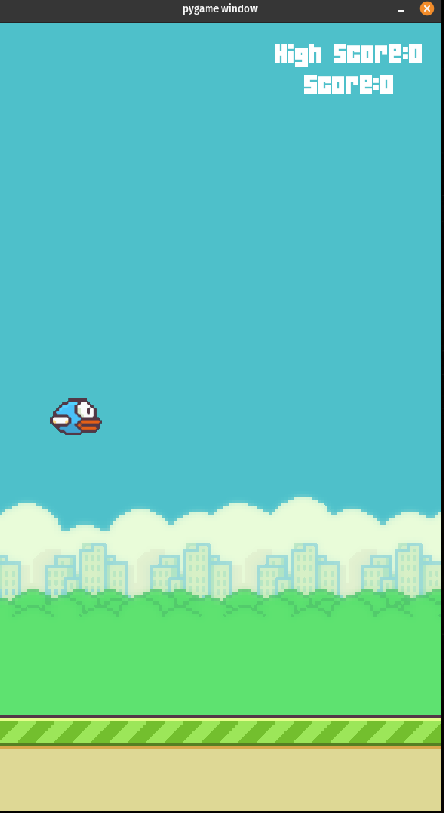
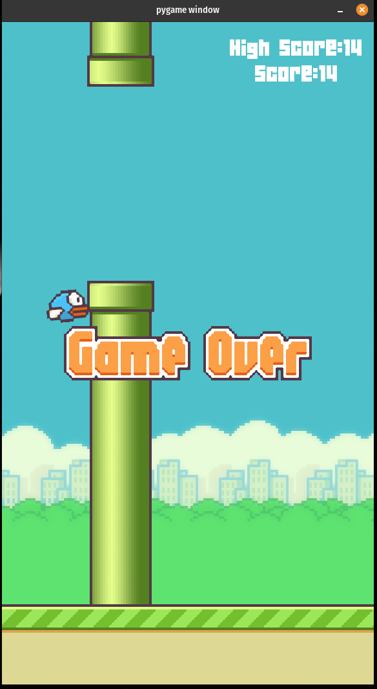

## flappy bird game in python using pygame
##### controls is the spacebar

#### how to start
install pygame <code> pip install pygame</code>

##### then run:
<code>python or python3 game.py</code>

 

